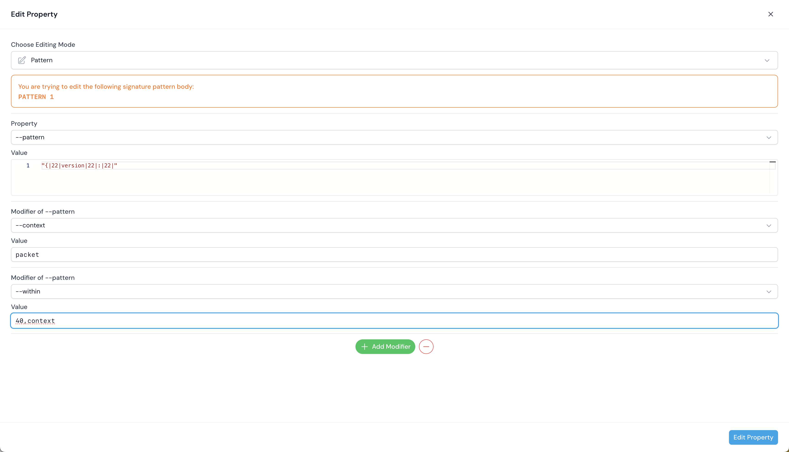

# Fortinet IPS/App Control Utilities

## Features

1. Signature Editor: Allow users to preview and edit the signature in a more friendly way.
2. Config Parser: Parsing the Fortinet products configuration in a friendly user interface.
3. Logs Preview: Parsing Fortinet logs to tablular view and support the full-text search.

## Screenshots
Parsing the signature in a more friendly way.

The property editor allows the user to edit the signature.

Config parser parses product configurations into an easy readable interface.

If the config contains the custom signature, the config parser will give the user a hint. 

Log parser parses the product logs into a tabular view.

Support the full-text and properties filter to view the logs. 


## Setup

Make sure to install the dependencies:

```bash
# npm
npm install

# pnpm
pnpm install

# yarn
yarn install

# bun
bun install
```

## Development Server

Start the development server on `http://localhost:3000`:

```bash
# npm
npm run dev

# pnpm
pnpm run dev

# yarn
yarn dev

# bun
bun run dev
```

## Production

Because this project contains the Nuxt Pro UI package, make sure you have the license key before making our project into production.

Build the application for production:

```bash
# npm
npm run build

# pnpm
pnpm run build

# yarn
yarn build

# bun
bun run build
```

Locally preview production build:

```bash
# npm
npm run preview

# pnpm
pnpm run preview

# yarn
yarn preview

# bun
bun run preview
```

